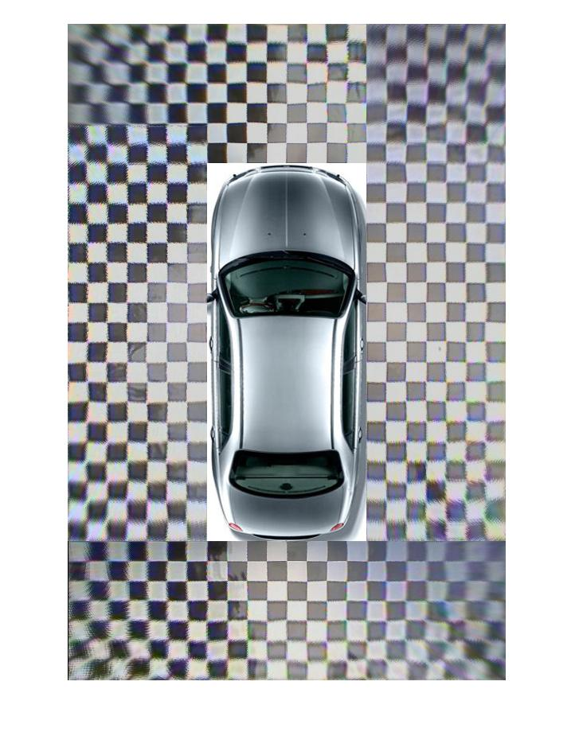

# 360-Degree-Panoramic-Display-System
This matlab code is a tiny part of my bachelor thesis (Vehicle 360 Degree Panoramic Display System) in 2013 for presenting what is parnormaic display system. The main code is written with C and run in DSP (TMS320DM642).

X*.txt store the position of corners extracted with corner deteciton and clustering algorithm in 1~4.jpg.

1-4.jpg are raw input image, and captured with fisheye camera installed around car.

# How to run:
- open and run the birdview.m
- a panoramic image will be generated from the 1~5.jpg

# DSP code
The DSP code is written in C and run real-time in DM642. The hardware should have four channels of input vedio and one output channel. Input cameras are fisheye camera and output is connected to central display screen in the car. The performance vedio can be [found](https://www.youtube.com/watch?v=WkR6sbVMnkQ&t=4s) 
